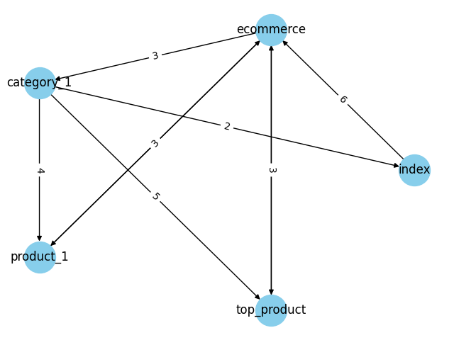

pages_graph.py - graph init, visualisation

tasks_1.py - graph analize

| Metric                | Value                                 |
| --------------------- | ------------------------------------- |
| Total nodes           | 5                                     |
| Total edges           | 9                                     |
| Max degree centrality | ecommerce 1.5                         |
| Path to top_product   | ['index', 'ecommerce', 'top_product'] |

tasks_2.py - bfs & dfs

| Algorithm     | Path                                                 |
| ------------- | ---------------------------------------------------- |
| bfs_recursive | ecommerce, category_1, top_product, product_1, index |
| dfs_recursive | ecommerce, category_1, product_1, index, top_product |

Різниця в виводі пов'язана з тим, що алгоритми BFS та DFS у різний спосіб проходять по вершинам графу

> BFS спочатку відвідує всі вузли, які безпосередньо з'єднані з "ecommerce", потім до наступних вузлів.

> DFS починає з "ecommerce" і йде в глиб графу до "до мертвого кінця", після чого він повертається назад, щоб знайти необхідні вершини, які ще не були відвідані, і продовжує цей процес, поки не відвідає всі вершини

tasks_3.py - dijkstra shortest path

| method name            | source      | target | result                                              |
| ---------------------- | ----------- | ------ | --------------------------------------------------- |
| shortest_path_dijkstra | top_product | index  | ['top_product', 'ecommerce', 'category_1', 'index'] |
